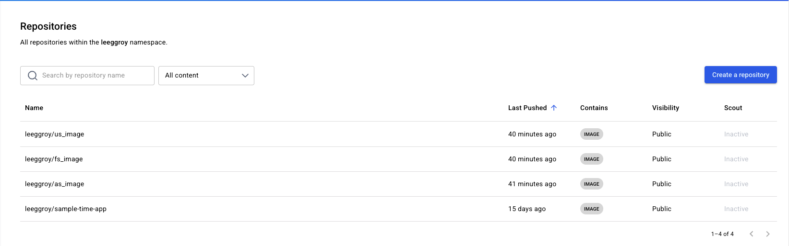
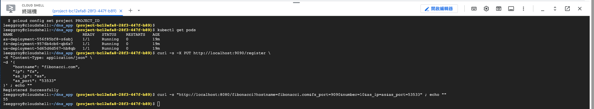

# Lab 3: DNS & Fibonacci App - GKE Deployment Proof

## Cloud Deployment (Extra Credit)

### 1. Docker Images (Public)

All services were successfully built (`linux/amd64`) and pushed to Docker Hub.

### 2. Kubernetes (GKE) Execution & End-to-End Testing

The system was deployed to a Google Kubernetes Engine (GKE) cluster. The tests below confirm successful internal routing and calculation:

1. **Service Registration:** FS successfully registered `fibonacci.com` with AS via UDP.
2. **DNS Resolution & Computation:** US successfully resolved the IP from AS and retrieved the 10th Fibonacci number (`55`) from FS.
   
